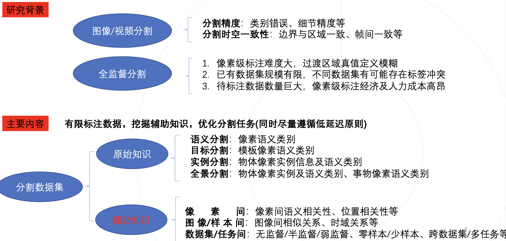
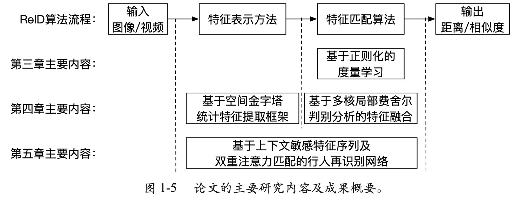
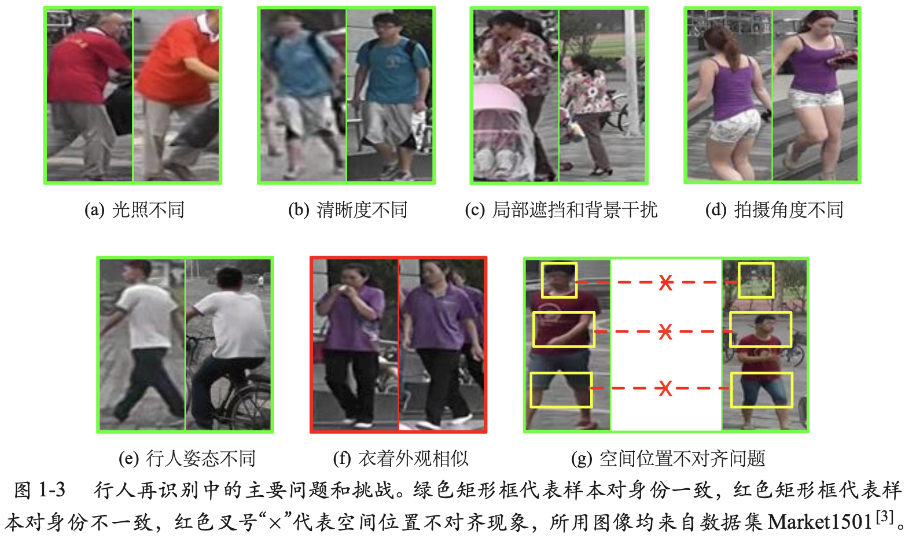

<head>

</head>

<body>
<h3>Academic Services</h3>

    <ul>
        <li>Conference Reviewer of CVPR, ICCV, ECCV, IJCAI, AAAI, BMVC, WACV, ACMM, ICME, NeurIPS, and so on</li>
        <li>Journal Reviewer of Neurocomputing, TMM, TPAMI, and so on</li>
        <li>Member of CCF and CSIG</li>
    </ul>    

<h3>Thesis, Technical Reports and Slids</h3>

    <ul>
        <li>
            
            "<a href="../assets/pdf/PostdoctoralFellowshipCompletionReport.pdf">基于辅助知识的图像/视频分割算法研究</a>", 
            报告, 2021.
        </li>
        <li>
            
            "<a href="../assets/pdf/DoctoralDissertation.pdf">智能视觉监控中行人再识别技术研究</a>", 
            学位论文, 2018.
        </li>
        <li>
            
            "<a href="../assets/pdf/DoctoralPresentation.pdf">智能视觉监控中行人再识别技术研究</a>", 
            学位报告, 2018.
        </li>
    </ul>    

<!-- Modal -->

    &times;
    

</body>

